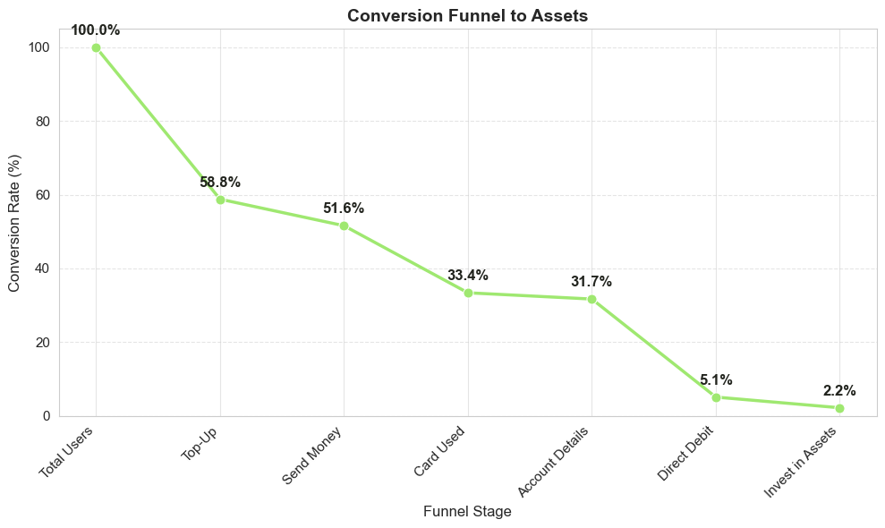

# Wise Product Analytics — Walid Bayoud

An end-to-end data analysis project using SQL and Python to examine customer conversion, feature adoption, and asset investment behavior. Includes funnel construction, segmentation, and time-series forecasting.

## Overview
Analyzed **10,000+ Wise user profiles** to optimize asset adoption funnel and forecast growth opportunities. Key findings include:
- **41% conversion drop-off** at top-up stage → Fixing this could recover 4,100+ users annually
- **£19.37M forecasted holdings growth** (£6.77M → £19.37M in 12 months)
- **Business users convert 2.2x higher** than personal users (4.16% vs 1.91%)
- **Feature engagement drives 24x conversion increase** (5-6 features vs 1-2 features)

The analysis includes:

- Customer funnel construction (sign-up → top-up → send → card → account details → direct debit → assets)
- Segmentation by user type, cohort, and engagement level
- Feature-specific conversion analysis
- Time-series forecasting (new asset customers and total holdings)
- Business-oriented insights and recommendations

The dataset is fully anonymized and provided explicitly for analysis purposes.

## Key Findings

1. **Funnel Conversion**
   - Largest drop-off occurs at Top-Up, with ~59% of users not completing this step.
   - Only 2.25% of users invest in Assets.

2. **User Segmentation**
   - Business users convert at 4.16%, compared to 1.91% for personal users.
   - Users engaging with 5–6 Wise features convert at 6.29%, approximately 24× higher than low-engagement users.
   - Direct Debit users show the strongest relationship with investment behavior (8.09% conversion).

3. **Forecasting**
   - Holt-Winters model predicts seasonal peaks in June and December for new asset investors.
   - ARIMA model forecasts total asset holdings increasing from £6.77M to £19.37M within 12 months, indicating consistent growth.

## Strategic Recommendations

### Immediate Actions (0-3 months)
1. **Fix Top-Up Drop-off** (41% loss)
   - Implement first-deposit incentives (cashback, fee waiver)
   - Improve onboarding UX with progress indicators
   - **Expected Impact**: Recover 15% of lost users → +4,100 asset investors annually

2. **Target Personal Users** (82% of base, only 1.91% conversion)
   - Launch APY boost campaigns for personal accounts
   - A/B test investment-focused onboarding flow
   - **Expected Impact**: If personal conversion reaches 3%, adds £3M+ in holdings

3. **Promote High-Value Features**
   - Push Direct Debit setup early (8.09% conversion rate)
   - Gamify feature adoption (0-2 features → 3-4 features = 16x conversion increase)

### Long-Term Strategy
- **Re-engage Q1 cohort** (27% lower conversion than Q2)
- **Capitalize on seasonality**: Align marketing spend with June/December peaks
- **Test auto-invest options** for recurring Direct Debit users

## Technical Stack

- SQL (SQLite)
- Python: pandas, matplotlib, seaborn, statsmodels
- Time-Series Models: ARIMA, Holt-Winters
- Data Analysis Techniques: funnel analysis, cohort analysis, segmentation, forecasting

## Result Visualizations

Example visual outputs are stored in the `images/` directory, including:

- Funnel conversion chart

- Asset Conversion by Engagement

- Forecasting – New Asset Customers
  
- Forecasting – Total Holdings
 

## Files

- **Notebook**: `notebook/Wise_Analytics_Project.ipynb`
- **Report**: `report/Wise_Analytics_Report.pdf`
- **Dataset**: `data/wise_data.sqlite`

  
## Skills Demonstrated
 **Product Analytics**: Funnel optimization, cohort analysis, user segmentation  
 **Advanced SQL**: Multi-table joins, CTEs, window functions, complex aggregations  
 **Statistical Forecasting**: ARIMA modeling, Holt-Winters exponential smoothing  
 **Business Strategy**: ROI-driven recommendations, actionable insights  
 **Data Visualization**: Executive-ready infographics, statistical charts (Seaborn, Matplotlib)  
 **Python for Analytics**: Pandas, NumPy, Statsmodels for large-scale data manipulation

## 👤 Author

**Walid Bayoud**  
Data Analyst | Computer Science BSc (GPA: 4.31) | Eötvös Loránd University  

📧 walidbayoud1@outlook.fr  
🔗 [LinkedIn](https://www.linkedin.com/in/walidbayoud/) | [GitHub](https://github.com/walidbayoud) | [Tableau](https://public.tableau.com/app/profile/walid.bayoud)

